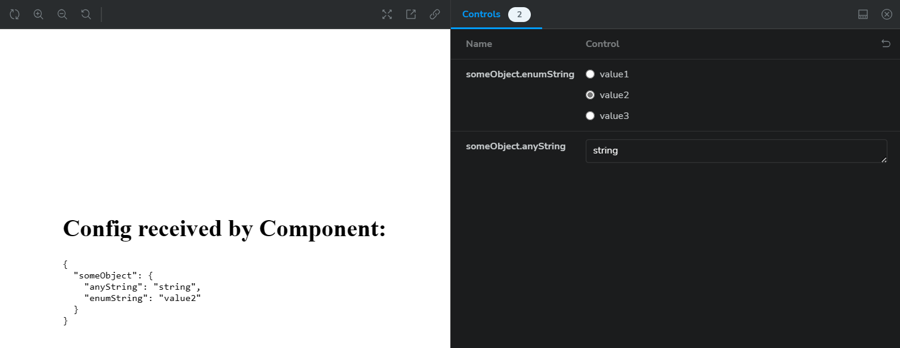

# Storybook Deep Controls Addon

This addon extends the functionality of the [@storybook/addon-controls](https://storybook.js.org/docs/react/essentials/controls) addon and provides an alternative to interact with object arguments.

The default JSON control used for objects provides an interface to interact with the JSON representation of the arg value which can be useful, however it can be difficult for deeply nested objects.

This addon tries to simplify this by splitting objects into multiple primitive controls for each deep primitive property. This allows you to interact with the object arg value and also benefit from general controls functionality e.g. defining different controls for different deep properties.

Generally, it turns this:


into this:


## Getting Started

First, install the addon:

```sh
npm i -D storybook-addon-deep-controls
```

Then add it to your `.storybook/main.*` file addons array:

```js
module.exports = {
  addons: ["storybook-addon-deep-controls"],
};
```

After this the addon is setup and ready to use in your stories. It is disabled by default and you will need to enable it via a story parameter, see examples below.

### Enabling for a specific story

Add the parameter to the story object:

```js
export const SomeStory = {
  ...
  parameters: {
    deepControls: { enabled: true },
  },
  ...
};
```

### Enabling for all stories in a component file

Add the parameter to the meta object (ie the default exported object):

```js
export default {
  ...
  parameters: {
    deepControls: { enabled: true },
  },
  ...
};
```

### Enabling for all stories in the project

Add the parameter to the global parameters object in the `.storybook/preview.*` file:

```js
export const parameters = {
  ...
  deepControls: { enabled: true },
  ...
};
```

or

```js
export default {
  ...
  parameters: {
    deepControls: { enabled: true, },
  },
  ...
};
```

### Example After Enabling

Below are some examples of what this looks like in the UI. This is for a story that generally serialises and displays the config it receives.

Example with/without the addon and some editing:


## Usage

Once you have this enabled for a story the addon will automatically split any defined object `args` into multiple primitive controls for each deep primitive property.

### Customising Deep Controls

You can customise the controls for each deep property by defining an `argType` for the flattened key. For example if you have an object arg property `foo` which has a property `bar` you can define an `argType` for the `bar` property using the path to the property, ie `foo.bar`, and this will define the control for that property.

Here is an example of this in use:

```js
export const SomeStory = {
  args: {
    someObject: {
      anyString: "string",
      enumString: "string", // we only want specific values for this
    },
  },
  argTypes: {
    "someObject.enumString": {
      control: "radio",
      options: ["value1", "value2", "value3"],
    },
  },
};
```

Which produces the following:



## Notes

Some notes about the functionality of this addon:

- It only splits plain objects into multiple controls, it does not split other objects, e.g. class instances, and controls wont be shown for these
- It does not support splitting arrays and they will be displayed using the default control
- It hides redundant controls for things that cant really be edited by a control e.g. functions, classes, class instances, symbols etc
